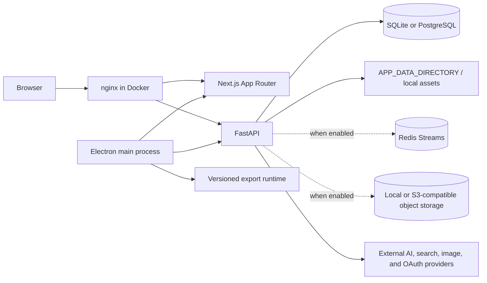

# Bayanly architecture

This is the engineering source of truth for the architecture represented in the repository today. It supersedes roadmap language when code and roadmap differ. Historical `Presenton` names remain in package names, paths, environment variables, database tables, and compatibility contracts.

## Repository topology

| Path | Current responsibility |
| --- | --- |
| `servers/fastapi` | Python 3.11 FastAPI modular monolith, API policy, domain/application modules, SQLModel persistence, Alembic migrations, background work, and provider/storage adapters |
| `servers/nextjs` | Next.js 16 App Router web application, product shell, presentation editor/renderers, localized English/Arabic UI, and server-side session guards |
| `electron` | Desktop outer adapter: process supervision, OS integration, IPC, packaging, updates, local resources, and isolated export invocation |
| `schemas/presentation-document` | Versioned renderer-independent presentation JSON Schema |
| `config` | Product/artifact identity, architecture boundary inventory, integrity pins, and licensing metadata |
| `scripts` | Deterministic repository generators, validators, packaging/integrity tooling, SBOM, secret scan, and governance checks |
| `templates`, `assets`, `readme_assets` | Bundled application/template and repository assets |
| `docs` | Detailed architecture, migration, localization, security, deployment, and provenance records |
| `.github/workflows` | CI, secret scanning, release images, and governance quality gates |
| `.specify`, `.agents/skills` | Existing Spec Kit/agent infrastructure; not application runtime code |

`presentation-export/` is not source in this repository. It is a separately versioned, checksum-pinned runtime synchronized by `scripts/sync-presentation-export.cjs` and ignored by Git.

## Runtime components

The production Docker image is an all-in-one runtime built by the root `Dockerfile`. `start.js` supervises FastAPI, Next.js, optional durable workers, and nginx; nginx exposes the same-origin HTTP surface and protects `/app_data` with an auth subrequest. `Dockerfile.dev` and the `development` Compose service mount the working tree. This is a self-hostable single deployment unit, not evidence of independently deployed microservices or horizontal production readiness.

Electron packages the same HTTP applications and serves them on loopback ports. It does not own product domain logic. Its main process owns trusted navigation, IPC, filesystem/process effects, updates, and export process isolation.

## Rollout state: current authority versus staged foundations

Several substantial modules exist but are not the default production authority. Defaults in `servers/fastapi/utils/architecture_flags.py`, `servers/nextjs/features/presentations/persistence/feature-flags.ts`, and `servers/nextjs/renderers/shared/feature-flags.ts` preserve compatibility.

| Capability | Implemented foundation | Default/current compatibility authority |
| --- | --- | --- |
| Presentation data | Canonical document API, conversion, schema validation, canonical renderers/editor commands | Legacy V1 reads/writes and Template V2 presentation/editor paths remain served; canonical read/write/render flags are off |
| Revision safety | Immutable revisions/patches, ETag/`If-Match`, idempotency, restore/recovery code | Revision writes, IndexedDB recovery, and history are off; blind-update bridge remains on |
| Tenant model | Workspaces, memberships, invitations, service accounts, RBAC, audit, workspace columns | Workspace/RBAC/invitation/service-account flags are off; owner isolation and legacy owner bridge remain active |
| Background work | SQL job truth, transactional outbox/inbox, Redis transport, leases, workers, cancellation, retry/dead letter | Durable job flags are off; FastAPI `BackgroundTasks` and process-scoped async work remain enabled |
| Assets | Workspace asset records, local/S3 providers, upload sessions, capabilities, quarantine/scanning lifecycle | Object-storage writes, direct uploads, and asset library are off; legacy paths/read-through remain active |
| Providers | Workspace registry, encrypted secrets, routing policy, health/circuit/usage, canonical executor | Registry/encryption/policy/fallback flags are off; legacy provider switches and some direct SDK integrations remain active |
| Executable layouts | Declarative canonical renderers and safe compatibility rendering | Legacy executable custom layouts exist but are disabled unless separate server/browser unsafe flags are explicitly enabled |
| Export | Integrity-pinned external runtime and isolated adapters | Unverified presentation export is disabled unless explicitly opted in |

Feature-flagged code is current implementation, but it MUST NOT be described as a completed production cutover. A rollout changes operational architecture and requires migration, compatibility, security, readiness, and rollback evidence.

## Request, identity, and authorization flow

`servers/fastapi/api/main.py` creates one FastAPI application and includes the auth, admin, presentation, webhook, async-task, workspace, job, asset, provider, and runtime-capability routers.

`SessionAuthMiddleware` in `servers/fastapi/api/middlewares.py` authenticates `/api/*`, `/app_data/*`, and API documentation, except the explicit login/logout/status/verify and health paths. It resolves one of:

- a browser JWT from the `presenton_session` cookie;
- a legacy administrator bearer access token;
- a feature-flagged workspace service credential.

The middleware establishes owner/admin/workspace/role/permission/service-account context. Admin paths require an admin browser JWT. When workspaces are enabled, the middleware validates the selected workspace and membership or service-account binding; when RBAC enforcement is enabled it maps route/method families to canonical permissions. Application queries use owner/workspace predicates such as `resource_scope_predicate` rather than trusting client identifiers.

Next.js uses `utils/serverAuth.ts` in protected server layouts and `components/Auth/AuthGate.tsx` at the login boundary. Those controls provide navigation and UX only. FastAPI remains authoritative for every access decision.

The current account system is administrator-provisioned username/password authentication. It has no public signup, email verification flow, password recovery, or self-service verification route. Those are roadmap items, not current architecture.

## Presentation lifecycle and canonical model

### Current compatibility flow

1. The Next.js creation/presentation routes call FastAPI presentation, outline, template, image, and chat endpoints.
2. FastAPI persists presentations, slides, templates, task status, and legacy asset paths through SQLModel services/repositories.
3. Generation currently may use legacy provider configuration and in-process background/task orchestration.
4. The active presentation page uses the existing presentation facade and Template V2/editor compatibility paths. `components/PresentationRender.tsx` dispatches supported persisted formats and retains V1 fallback.
5. Exports cross the separately versioned runtime boundary; Electron invokes it in an isolated child process when verification policy permits.

### Canonical controlled path

The interchange source is `schemas/presentation-document/v1.schema.json`. `servers/fastapi/modules/presentations/domain/document.py` owns the strict Python model and validation; `scripts/generate-presentation-document.mjs` generates/checks the TypeScript binding under `servers/nextjs/generated`.

A `PresentationDocument` contains stable document/presentation/slide/element/asset IDs, locale and direction, physical geometry, theme/font policy, declarative elements, notes, compatibility metadata, and bounded export hints. It does not contain ORM objects, owner/workspace policy, resolved URLs, local paths, signed capabilities, provider responses, React/Konva/DOM instances, undo state, arbitrary HTML, or executable source.

`api/v1/ppt/endpoints/presentation_document.py` owns canonical reads/writes/conversion. Canonical persistence uses `presentation_documents`; immutable snapshots and command patches use `presentation_revisions` and `presentation_revision_patches`. Writes use revision preconditions and idempotency and update the materialized document in one transaction. The rollout flags are off by default.

`servers/nextjs/components/editor` owns transient canonical view state and typed commands. `servers/nextjs/renderers/shared`, `renderers/konva`, and `renderers/browser` consume the canonical union through renderer adapters. Renderers never own persistence. Asset URLs are resolved at runtime from authorized asset IDs and do not flow back into the document.

## Persistence and migrations

`servers/fastapi/services/database.py` owns shared async SQLAlchemy/SQLModel engines and session factories. `DATABASE_URL` selects the database; the local fallback is SQLite under application data, while PostgreSQL is the production/distributed integration path represented in CI and tests.

Legacy tables live under `models/sql`; modular workspace, job, asset, and provider tables live under their module persistence packages. This is one database and one SQLModel metadata graph, not multiple persistence systems.

Alembic under `servers/fastapi/alembic` is the schema-evolution authority. `migrations.py` handles startup upgrade and compatibility stamping for recognized legacy schemas. Compose sets `MIGRATE_DATABASE_ON_STARTUP=true`; the lifespan also calls `create_db_and_tables` for compatibility. New evolution still requires an Alembic revision: `create_all` is not migration authority. `scripts/check_migrations.py` enforces one base/head and can exercise a disposable PostgreSQL upgrade/idempotency smoke.

`servers/fastapi/openai_spec.json` is the checked-in artifact for the intended HTTP contract workflow, and `scripts/generate_openapi_spec.py --check` compares it with the schema generated from the application. The governance-audit drift was synchronized through the owning generator after review; future route or schema changes MUST keep check mode green and MUST NOT edit the generated artifact manually.

## Provider and outbound-network boundaries

`servers/fastapi/modules/providers` is the canonical provider platform. Its domain contracts normalize text, image, and search requests/results. `application/executor.py` performs policy routing, secret resolution, bounded timeout, adapter invocation, result validation, health/circuit updates, usage attribution, and bounded fallback. Provider secrets use the envelope-encryption boundary in `modules/providers/security/secrets.py`; the master key remains an operator secret.

Legacy direct provider clients still exist in `services/image_generation_service.py`, `utils/available_models.py`, `utils/llm_provider.py`, and compatibility adapters. They are explicit migration debt and cannot be copied into new feature code. Provider fallback and durable job retry are separate layers and must remain finite.

`servers/fastapi/utils/outbound_http.py` is the canonical boundary for configurable or user-influenced server-side destinations. It validates scheme, credentials, port, exact private-origin allowlists, DNS answers, metadata/private/link-local/reserved addresses, redirects, timeouts, and response size, and pins validated DNS answers into the connection resolver. Proxy environment variables are ignored. Existing direct network callers are legacy/reviewed exceptions, not a general extension point.

## Background and durable work

The current default background architecture uses FastAPI `BackgroundTasks`, persisted `AsyncTaskModel` status, request-process `asyncio` tasks, bounded threads, and export subprocesses. This work is not guaranteed to survive process termination.

`servers/fastapi/modules/jobs` provides the controlled durable path. PostgreSQL is authoritative for jobs, attempts, leases, events, outbox, consumer inbox, and dead letters. Redis Streams is delivery transport only. Delivery is at least once; idempotency keys, inbox receipts, lease tokens, pinned source revisions, and handler authority checks protect effects. Payloads/results are bounded, secret-shaped payload fields are rejected, attempts are capped, retry classes are explicit, and terminal failures dead-letter or fail. The worker starts only when durable jobs are enabled and a transport is configured.

No feature may create an independent queue, retry loop, or durable status model when this boundary applies.

## Storage boundary

Current legacy bytes live under `APP_DATA_DIRECTORY` and transient work under `TEMP_DIRECTORY`; packaged `static/`, Next `public/`, and Electron resources are build-owned. Path helpers and auth middleware enforce containment/ownership for served application data.

`servers/fastapi/modules/assets` is the managed storage boundary. Asset IDs are durable identity; object keys and signed URLs are adapter details. The local provider rejects traversal/symlink escapes. The S3-compatible provider uses private objects, bounded presigned capabilities, optional server-side encryption, and one SDK attempt so application retry policy stays authoritative. Upload completion verifies size/checksum/MIME, then quarantine and scanner state precede readiness. The deterministic development scanner is not production malware protection.

New durable presentation/job/provider payloads refer to asset IDs, not raw bytes, public URLs, or local paths.

## Localization boundary

The application shell currently supports English (`en`, LTR) and Arabic (`ar`, RTL). `servers/nextjs/i18n` owns negotiation, route prefixing, catalog access, formatting, and observability; `proxy.ts` redirects/rewrites locale-prefixed routes; the root layout sets `lang` and `dir`. English and Arabic JSON catalogs must have identical keys, safe plain-text values, and identical interpolation variables.

Application chrome uses logical direction and RTL styling. Presentation content locale/direction belongs to the canonical presentation document and is independent of shell locale. Canvas geometry and element order are physical and are not mirrored for Arabic UI.

Additional locales in the roadmap are planned, not implemented.

## Browser, configuration, and deployment boundaries

`servers/nextjs/next.config.mjs` applies headers from `lib/security-headers.mjs`. Markdown HTML sinks route through `lib/safe-markdown.ts`. Legacy generated-slide HTML has a separately documented compatibility boundary; canonical browser renderers remain declarative.

Configuration comes from process environment and the local `userConfig.json` store managed by `start.js`/FastAPI configuration helpers. `start.js` writes the local configuration atomically with restrictive file mode where supported. Public `NEXT_PUBLIC_*` values are browser-visible and MUST NOT contain secrets. Provider registry encryption uses a separate master-key contract when enabled.

Readiness checks database and operation controls, and conditionally checks Redis and object storage when their architectures are enabled. The repository's nginx terminates plain HTTP inside the image; external TLS, HSTS, load balancing, backups, production secret management, managed Redis/PostgreSQL/S3, and network policy are deployment responsibilities, not capabilities proven by this repository.

## Dependency direction and extension points

- FastAPI transport (`api`) -> application/domain (`modules` or established services) -> persistence/adapters; domain code does not depend on FastAPI request objects or provider endpoint modules.
- Next route/layout (`app`) -> feature packages -> shared UI/lib/renderers. Shared UI does not import features/routes.
- Canonical editor -> renderer adapters -> shared canonical contracts. Renderers do not persist editor state or call provider/API transports.
- Electron -> HTTP applications and controlled external runtimes. Web code never imports Electron main-process modules.
- Generated bindings depend on versioned schemas/generator input; consumers do not copy generated contracts into local types.

Extension points are the owned FastAPI router/module pairs, canonical presentation schema plus generator, provider adapter registry, job handler registry, storage provider protocol, feature flags/capability API, localization catalogs, and Electron's validated IPC/resource helpers. New extensions must preserve the owning boundary and update its tests, docs, configuration inventory, and route owner entry where applicable.

## Forbidden shortcuts and evolution rules

- Do not create a second presentation document, provider executor, HTTP security client, queue, object-store abstraction, auth context, or database migration system.
- Do not treat frontend guards, hidden controls, owner IDs from clients, or signed URLs as authorization.
- Do not store executable layout code, renderer objects, signed URLs, provider payloads, or secrets in canonical documents or durable jobs.
- Do not bypass feature gates by calling controlled implementations directly from production entry points.
- Do not delete compatibility data/code until telemetry, conversion/export, rollback, and owner approval criteria in the deprecation records are met.
- Evolve public APIs and canonical schemas explicitly and version contracts when compatibility cannot be preserved.
- Keep migrations additive/backfillable where possible; separate rollout from destructive cleanup.

## Planned evolution (not current implementation)

`Sprint_exeuteive.md` plans public account verification/recovery in Sprint 10.10, structured generation in Sprint 11, exact-count image jobs in Sprint 12, commercial/usage systems, export qualification, conversion tooling, operations, and production scaling. None of those roadmap descriptions proves current implementation. Future work must re-audit the repository and update this document only when the implementation and rollout state actually change.
